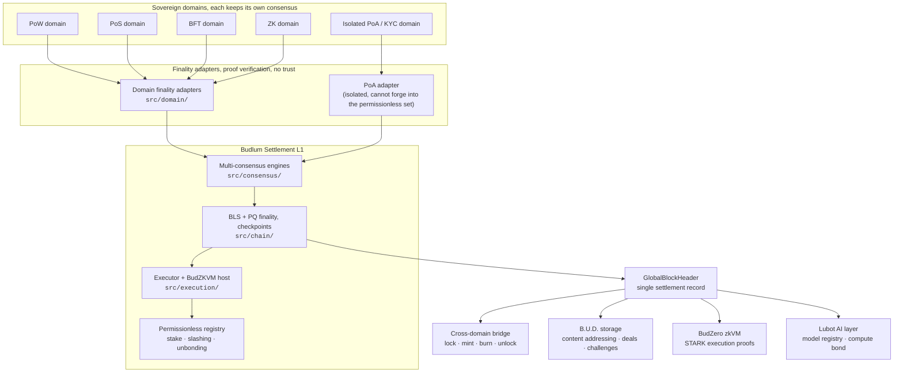

<div align="center">

# Budlum

**The Universal Settlement Layer.**

Budlum is a permissionless Layer-1 that does not compete with other chains, it *settles* them.
PoW, PoS, PoA, BFT and ZK domains each keep their own consensus; Budlum verifies their
finality proofs and records cross-domain value transfer as a cryptographic fact on a single
`GlobalBlockHeader`. Sovereignty over data, keys and computation stays with the participants.

[](https://github.com/budlum-xyz/budlum/actions/workflows/ci.yml)
[](https://github.com/budlum-xyz/budlum/actions/workflows/ci.yml)
[](rust-toolchain.toml)
[](LICENSE.md)

[Architecture](ARCHITECTURE.md) · [Specification](SPECIFICATION.md) · [Security](SECURITY.md) · [Contributing](CONTRIBUTING.md) · [Website](https://github.com/budlum-xyz/budlum.com)

</div>

---

> [!WARNING]
> **Budlum has not launched a mainnet and has not been audited.** This repository is
> research-grade, controlled-devnet software. Do not use it for real-value traffic.
> See [Project status](#project-status) for exactly what is implemented, what is
> deliberately unfinished, and what is not claimed.

---

## Contents

- [Why Budlum](#why-budlum)
- [How settlement works](#how-settlement-works)
- [Repository layout](#repository-layout)
- [Getting started](#getting-started)
- [Running a node](#running-a-node)
- [JSON-RPC](#json-rpc)
- [Engineering standards](#engineering-standards)
- [Security](#security)
- [Project status](#project-status)
- [Documentation](#documentation)
- [Contributing](#contributing)
- [License](#license)

---

## Why Budlum

| Problem | Budlum's answer |
| --- | --- |
| **Fragmentation.** Thousands of isolated chains, each with its own finality, none of which the others can verify. | A settlement layer that verifies *any* domain's finality proof and records the result in one global header. |
| **Bridge risk.** Custodial and multisig bridges have lost billions; the failures are almost always missing verification, not broken cryptography. | A `lock → mint → burn → unlock` lifecycle where every mint recomputes a bounded proof and re-derives the payload hash from `(asset_id, amount)` before crediting anything. |
| **The quantum horizon.** Ed25519 and ECDSA are expected to be breakable within the lifetime of a chain launched today. | Hybrid finality: BLS12-381 aggregate signatures alongside a post-quantum scheme (Dilithium5 by default, ML-DSA selectable at genesis and pinned into the chain's identity). |
| **Operator custody of user data.** "Decentralized" networks whose storage, RPC and inference all terminate at one company. | No admin key, no pause hook, no whitelist. Storage, RPC and AI endpoints run on any node; participation is stake-gated, not permission-gated. |
| **Unverifiable off-chain compute.** AI output presented as fact with nothing behind it. | An in-tree zkVM (BudZero) that produces STARK proofs of execution. Inference proof *verification* is not yet enabled, the transaction path [fails closed](docs/AI_VERIFICATION_STATUS.md) rather than trusting an unverified result. |

**The data-sovereignty invariant.** No critical function in the network depends on a service
operated by the Budlum team. This is not a value statement, it is a property the test suite
and CI gates enforce, and a pull request that introduces an admin path fails them.

---

## How settlement works



A domain submits a finality proof. The matching adapter verifies it against that domain's own
rules, a PoA domain's proof is structurally prevented from being valid in the permissionless
set, which is the boundary that makes a KYC'd domain safe to host next to an open one. Once
verified, the commitment enters the `GlobalBlockHeader`, and every downstream subsystem
(bridge, storage, zkVM, AI) reads settlement from that one record rather than trusting a
domain directly.

### Where the diagrams live

[**ARCHITECTURE.md**](ARCHITECTURE.md) is the reference atlas for this tree: 51 Mermaid
diagrams covering the executor pipeline, bridge verification, the EVM receipt and MPT path,
the snapshot trust boundary, the STARK proof lifecycle, and the governance and tokenomics
state machines. [budzero/ARCHITECTURE.md](budzero/ARCHITECTURE.md) covers the BudZKVM ISA,
VM, prover and verifier separately, since BudZero is its own workspace.

Both are code maps first and design documents second. Where a diagram and the code disagree,
the code is the fact and the diagram is the bug.

---

## Repository layout

This repository is the whole stack. The layers below are **in-tree**, not separate
dependencies, so the entire system builds, tests and ships as one tree.

### The L1 core: [`src/`](src)

| Path | Role |
| --- | --- |
| [`src/consensus/`](src/consensus) | PoW · PoS · PoA · BFT engines, block-size and reorg-depth bounds |
| [`src/chain/`](src/chain) | Blockchain, BLS/QC finality, checkpoints, snapshots |
| [`src/domain/`](src/domain) | Domain registry and per-domain finality adapters |
| [`src/cross_domain/`](src/cross_domain) | Bridge lifecycle, cross-domain messages, replay protection |
| [`src/execution/`](src/execution) | Transaction executor and BudZKVM host |
| [`src/registry/`](src/registry) | Permissionless stake registry (validator · verifier · relayer · storage) and slashing |
| [`src/core/`](src/core) | Accounts, blocks, transactions, chain config, genesis |
| [`src/mempool/`](src/mempool) | Admission control and cheap pre-signature rejection |
| [`src/network/`](src/network) | libp2p stack, wire protocol, peer scoring and bans |
| [`src/crypto/`](src/crypto) | Ed25519, BLS12-381, Dilithium / ML-DSA, PKCS#11 |
| [`src/rpc/`](src/rpc) | JSON-RPC: split public/operator listeners, auth, per-IP quota, CORS |
| [`src/tokenomics/`](src/tokenomics) | `$BUD` supply, burn schedule, vesting, validator rewards |

### Composable layers

| Layer | In this repo | What it is |
| --- | --- | --- |
| **BudZero** | [`budzero/`](budzero), [README](budzero/README.md) | ZK-native VM: deterministic ISA, gas-metered VM, compiler, and a Plonky3 STARK prover/verifier |
| **B.U.D.** | [`src/storage/`](src/storage) | Broad Universal Database, data-sovereign storage with content addressing, deals and challenge/response proofs |
| **Lubot** | [`src/lubot/`](src/lubot) | Closed-circuit AI layer: model registry, operator compute-bond, effort tiers, Pollen-gated data access |
| **Pollen** | [`src/pollen/`](src/pollen) | Consent-gated data marketplace, grants, encryption, and the gate the AI layer must pass |
| **BNS** | [`src/bns/`](src/bns) | `.bud` naming: registration, subdomains, content and storage records |
| **Wallet Core** | [`wallet-core/`](wallet-core), [README](wallet-core/README.md) | BIP39 + SLIP-0010 Ed25519 derivation and transaction signing. A wallet, not a relayer |

### Supporting trees

| Path | Contents |
| --- | --- |
| [`config/`](config) | Devnet / testnet / mainnet profiles and genesis templates |
| [`scripts/`](scripts) | CI gate scripts, every one is self-testing (see [Engineering standards](#engineering-standards)) |
| [`kani/`](kani) · [`fuzz/`](fuzz) | Model-checking harnesses and fuzz targets ([fuzz README](fuzz/README.md)) |
| [`benches/`](benches) | Signature-verification, Merkle and single-node throughput benchmarks |
| [`ops/`](ops) | systemd unit, Prometheus config, backup/restore drill |
| [`proto/`](proto) | Protobuf wire schemas |
| [`supply-chain/`](supply-chain) | `cargo-vet` audit records |

### Related repositories

| Repository | Purpose |
| --- | --- |
| [budlum-xyz/budlum.com](https://github.com/budlum-xyz/budlum.com) | Project website |
| [budlum-xyz/budlum.xyz](https://github.com/budlum-xyz/budlum.xyz) | Brand and design system |

---

## Getting started

### Prerequisites

- **Rust 1.94.0**: pinned in [`rust-toolchain.toml`](rust-toolchain.toml); `rustup` selects it automatically
- **protoc** (Protocol Buffers compiler): `apt install protobuf-compiler` or `brew install protobuf`
- Optional: [Nix](https://nixos.org), `nix develop` provisions the full toolchain from [`flake.nix`](flake.nix)

### Build and test

```bash
git clone https://github.com/budlum-xyz/budlum.git
cd budlum

cargo build --release              # the L1 node
cargo test --lib                   # the L1 test suite

# BudZero / BudZKVM is its own workspace
cargo test --manifest-path budzero/Cargo.toml --workspace
```

Before opening a pull request, run the same checks CI runs:

```bash
bash scripts/pre-push-check.sh     # fmt + clippy + tests against the pinned toolchain
```

### Build features

| Feature | Default | Effect |
| --- | --- | --- |
| `pq-dilithium` | ✅ | Dilithium5 post-quantum signatures (`pqcrypto-dilithium`) |
| `pq-ml-dsa` | - | FIPS 204 ML-DSA instead. Mutually exclusive with `pq-dilithium`; the scheme is written into genesis and a node whose build disagrees with the chain refuses to start |
| `p2p-mdns` | - | Devnet-only local peer discovery. Deliberately excluded from release builds so mDNS advisories stay unreachable |

`cargo build --all-features` is **expected to fail**: the PQ backends are mutually exclusive
and a `compile_error!` enforces it. CI asserts that failure, so the guard cannot silently rot.

---

## Running a node

### Devnet, single node

```bash
cargo run --release -- --network devnet
```

### Devnet, four nodes + Prometheus

```bash
docker compose up            # see docker-compose.yml
bash scripts/devnet-multinode-smoke.sh
```

### From a profile

```bash
cargo run --release -- --config config/devnet.toml
```

Profiles live in [`config/`](config): [`devnet.toml`](config/devnet.toml),
[`testnet.toml`](config/testnet.toml), [`archive.toml`](config/archive.toml) and the
[`mainnet.toml`](config/mainnet.toml) ceremony template. The mainnet genesis is an
**unlaunchable template**: bootstrap peers, DNS seeds and allocations are placeholders, and
a fail-closed guard rejects them, so no one can accidentally start "mainnet" against a
ceremony file.

### Node roles

`--role` selects the profile a node runs under: `validator`, `sentry`, `seed`, `rpc` or
`archive`. Each has a different exposure surface and a different set of required guarantees,
see [docs/VALIDATOR_ROLES.md](docs/VALIDATOR_ROLES.md).

> [!IMPORTANT]
> **Mainnet validators must sign through PKCS#11.** Disk-backed `ValidatorKeys`, BLS and
> post-quantum material sitting in a file, are rejected on the mainnet profile. This is not
> advisory; the node refuses to start.

### Operating

Metrics are exposed in Prometheus format (default `:9090`; scrape config in
[`ops/prometheus.yml`](ops/prometheus.yml)). A systemd unit is provided at
[`ops/budlum-core.service`](ops/budlum-core.service), and
[`ops/backup_restore_drill.sh`](ops/backup_restore_drill.sh) exercises the snapshot
backup/restore path end to end: run it before you need it.

---

## JSON-RPC

The node exposes a `bud_`-namespaced JSON-RPC API over **two separate listeners**: a public
one (chain reads, transaction submission) and an operator one bound to loopback (node
control, key operations, peer management). Splitting them means an exposed public port cannot
reach an operator method regardless of how the handler is written.

```bash
curl -s -X POST http://127.0.0.1:8545 \
  -H 'Content-Type: application/json' \
  -d '{"jsonrpc":"2.0","id":1,"method":"bud_getStatus","params":[]}'
```

The API covers chain and account state, blocks, transactions and receipts, the validator set
and slashing history, domain commitments and settlement info, the bridge lifecycle, BNS
resolution, the Pollen marketplace, the AI inference lifecycle, and node health. The full
method list with auth requirements per listener is in
[SPECIFICATION.md § 3.3](SPECIFICATION.md).

A minimal CLI client ships in the same tree:

```bash
cargo run --bin bud -- query balance <address>
cargo run --bin bud -- query block latest
cargo run --bin bud -- tx send --to <address> --amount <n> --priv-key <hex-seed>
```

---

## Engineering standards

Budlum's CI is not a formality, it is the mechanism the project uses instead of trust.
Every pull request runs the full gate set across dedicated workflows for the core build,
BudZero, determinism, security audit, supply chain, fuzzing, Miri, semver and more.

**What the gates enforce, beyond the usual:**

- **`fmt` and `clippy` with `-D warnings`** against the pinned 1.94.0 toolchain, plus a
  separate pedantic/nursery **ratchet**: the warning count has a checked-in baseline and may
  only go down. Raising the baseline to make a run pass is treated as a defect, not a fix.
- **Determinism.** State roots and block hashes must be reproducible. A dedicated gate proves
  no hashing function iterates an unordered collection, a `HashMap` in a state-root path is
  a chain halt waiting for two nodes to disagree, and the gate catches it at review time.
- **The badge cannot lie.** The test count on this page is compared against what the run
  actually measured, and a mismatch fails the pull request that caused it.
- **Tests must be tests.** Every name a gate declares as required is checked to actually carry
  `#[test]`, a required test that silently stopped existing would otherwise pass forever.
- **Formal methods.** [Kani](kani) model-checks arithmetic invariants; `cargo fuzz` targets
  cover wire deserialization; Miri runs the suite under UB detection.
- **Supply chain.** `cargo-deny`, `cargo-audit`, `cargo-vet`, `osv-scanner`, Grype, SBOM
  generation, `zizmor` and `actionlint` on the workflows themselves. Actions are SHA-pinned;
  the one git dependency is pinned by full revision with the reason recorded in-tree and
  **the patch itself verified in the vendored source**, because a version number on a git
  dependency is a name, not evidence.

**Two rules make the rest meaningful:**

1. **No gate may be vacuous.** Every `scripts/check-*.sh` implements `--self-test`, which
   injects a real violation and fails if the gate does not catch it. A gate that cannot prove
   it can fail is not a gate, and CI runs the canary next to the check itself.
2. **No gate may be orphaned.** A gate script that no workflow invokes fails the build by
   name. Wire it up or delete it, it does not get to sit in `scripts/` inflating a count.

Suppressions are not part of the workflow. `#[allow(...)]`, `#[ignore]`, `|| true` and
baseline inflation are how a green build stops meaning anything, and none of them are
accepted as a fix here.

---

## Security

Report vulnerabilities **privately**: see [SECURITY.md](SECURITY.md). Please do not open a
public issue for anything affecting consensus safety, execution determinism, networking,
storage integrity, cryptography or validator key handling.

Hardening is continuous and adversarial. A sample of what is enforced in code today:

- **Bridge.** A mint re-derives `bridge_payload_hash(asset_id, amount)` and requires a matching
  `Locked` state plus a bounded, recomputed proof. Source-amount confusion, the class behind
  several eight-figure bridge losses, is rejected structurally, not by convention.
- **Consensus bounds.** Reorg depth, block size and finalized-checkpoint conflict are each
  enforced by a single constant with a compile-time assertion tying the layers together, so
  fork-choice and the state machine cannot end up applying different limits.
- **Liveness and slashing.** A jailed validator stops accruing downtime for blocks it is
  forbidden to sign, and every liveness path is asserted to see the same validator set.
- **Keys.** BLS keypair loading validates G2 encoding and that `pk = g·sk`. Mainnet validator
  signing is PKCS#11-only. Signature verification functions are audited for real call sites,
  because a correct-but-uncalled `verify_*` enforces nothing.
- **RPC.** Public auth fails closed with a constant-time API-key comparison, per-IP quotas and
  an explicit CORS allow-list.
- **Fail-closed by default.** Where a guarantee is not yet provable, inference proof
  verification, BudZKVM `VerifyMerkle` at production depth: the path is **disabled**, not
  optimistically allowed. The list of these is in [docs/](docs) rather than left implicit.

**No external audit has been performed.** Nothing above substitutes for one, and no "audited"
claim is made anywhere in this repository.

---

## Project status

**Implemented and tested:** multi-consensus L1 (PoW/PoS/PoA/BFT) · BLS + post-quantum hybrid
finality · domain registry and finality adapters · cross-domain bridge lifecycle with forgery
gates · permissionless stake registry with slashing and unbonding · in-tree BudZKVM with
STARK proving · B.U.D. storage with deal and challenge economy · BNS `.bud` names · Pollen
data marketplace · SocialFi primitives · Lubot AI inference layer · EVM chain adapter
(RLP + MPT + receipt verification) · `$BUD` tokenomics · validator governance · snapshot V2
with chunk-session binding.

**Deliberately not enabled, and pinned by tests that break if that changes:** on-chain AI
inference proof *verification* ([status](docs/AI_VERIFICATION_STATUS.md)) · BudZKVM
`VerifyMerkle` at production depth · BNS renewal and transfer (no transaction type reaches
them) · the solver-economics module.

**Not claimed:** TLA+ formal verification of the protocol · a complete ZK privacy layer ·
full on-chain AI execution · vendor-native BLS/PQ HSM support beyond Ed25519 PKCS#11 ·
an external security audit · a launched mainnet.

The distinction matters: the second group is code that exists and is intentionally gated off,
with a failing test standing guard over the gate. The third group is work that has not been
done, and this page will not imply otherwise.

---

## Documentation

| Document | What it covers |
| --- | --- |
| [ARCHITECTURE.md](ARCHITECTURE.md) | Reference atlas: 51 diagrams covering system, trust boundary, bridge, EVM verification, snapshot, STARK, governance and tokenomics |
| [SPECIFICATION.md](SPECIFICATION.md) | Protocol specification: consensus, validator economics, network protocol, BLS finality, JSON-RPC surface, snapshot format |
| [SECURITY.md](SECURITY.md) | Disclosure policy, supported versions, what to include in a report |
| [CONTRIBUTING.md](CONTRIBUTING.md) | Development setup, PR expectations, rules for consensus and execution changes |
| [CODE_OF_CONDUCT.md](CODE_OF_CONDUCT.md) | Community expectations |
| [PROVENANCE_NOTES.md](PROVENANCE_NOTES.md) | Per-module record of what each non-trivial implementation is based on |
| [docs/VALIDATOR_ROLES.md](docs/VALIDATOR_ROLES.md) | Node roles and their operational requirements |
| [docs/AI_VERIFICATION_STATUS.md](docs/AI_VERIFICATION_STATUS.md) | Exactly what the AI layer does and does not verify |
| [docs/BUD_STORAGE_ROADMAP.md](docs/BUD_STORAGE_ROADMAP.md) | Storage layer roadmap |
| [budzero/ARCHITECTURE.md](budzero/ARCHITECTURE.md) | BudZKVM ISA, VM, prover and verifier design |

---

## Contributing

Contributions are welcome. Read [CONTRIBUTING.md](CONTRIBUTING.md) first, it sets a higher
bar for consensus and execution changes than for tooling, and explains why.

The short version:

1. Run `bash scripts/pre-push-check.sh` before pushing. Formatting is not guessed by hand.
2. New behaviour arrives with a test that was observed to fail before the fix.
3. If your change makes a CI gate red, the gate is the finding. Fix the cause, do not silence
   the signal.

---

## License

Licensed under the **Apache License 2.0**: see [LICENSE.md](LICENSE.md) and [NOTICE](NOTICE).
